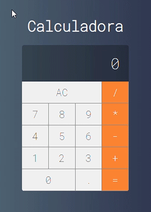

# Projeto-Calculadora-React
Projeto de estudo criando réplica da calculadora do MacOS usando React

Projeto criado como parte dos estudos de React no curso: <a href="https://www.udemy.com/course/curso-web/" target="blank">Web Moderno com JavaScript 2020</a>